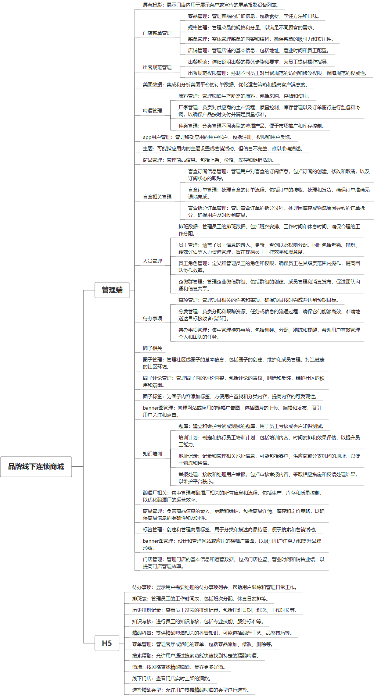

 

    
 

公司拥有上百套具有自主知识产权的软件系统，详情请查看码云首页或公司官网

 
<h1>品牌线下连锁商城</h1>

<a href="https://www.haishi.net.cn/">公司官网</a> ｜ <a href="https://www.haishi.net.cn/">在线体验</a>

 

## 系统介绍

包含门店管理、监管、培训等，支持客户端购买、活动等工能
包含门店管理、监管、培训等，支持客户端购买、活动等工能
---
本项目名称为品牌线下连锁商城系统，是面向线下连锁商城的综合管理系统，涵盖了门店运营、商品管理、用户管理、营销推广、数据分析等多个方面。
本项目从用户层面至少包含两个端：
- 管理端：公司内部管理员用户使用，可以进行门店菜单管理、出餐规范管理、人员管理、知识培训、举报处理等
- 用户端App：顾客使用，可以进行商品购买、参与营销活动、在线下单等
---
                

## 系统功能介绍

### 系统包含终端说明

管理端（WEB）、用户端（微信小程序、Android App、IOS App）

| 序号 | 模块 | 模块说明 |
| --- | --- | --- |
| 1 | FWY-SHOP-LSJY-FRONT | 前端合集 |
| 2 | FWY-SHOP-LSJY-SERVER | 服务端 |

### 系统功能结构

### 系统功能说明

- 门店菜单管理：管理菜单，包括菜品、规格、店铺等信息，实现对不同门店菜单的差异化管理。
- 出餐规范管理：制定标准化的出餐流程和规范，并对员工进行权限管理，确保菜品质量和服务水平。
- 人员管理：实现对员工信息、排班、角色、培训等方面的管理，提高人力资源管理效率。
- 知识培训：建立题库和培训计划，对员工进行培训考核，提升员工的业务能力和服务意识。
- 举报处理：建立顾客反馈渠道，处理顾客的举报和投诉，提升顾客满意度。

## 系统主要界面

## 系统技术说明

### 代码模块说明

| 序号 | 目录 | 目录说明 |
| --- | --- | --- |
| 1 | FWY-SHOP-LSJY-SERVER/stores | -- |
| 2 | FWY-SHOP-LSJY-SERVER/server | -- |

### 系统技术选型

#### 开发语言/框架

JAVA（JDK1.8）
其他

#### 服务中间件

Tomcat
Nginx

#### 数据库

MySQL（5.7+）

#### 其他说明

无

## 系统演示/商用

请扫码添加客服微信获取演示地址和系统详细资料。

如果您想基于品牌线下连锁商城进行商业化交付或定制开发服务，我们提供有偿的技术服务支持，合作模式不限，欢迎沟通！

公司官网地址： <a href="https://www.haishi.net.cn/">https://www.haishi.net.cn</a>

联系客服获取专业回答。

## 使用须知

1、 本项目商用必须获得版权所有者的授权。

2、 未经允许本项目代码不允许二次出售。

